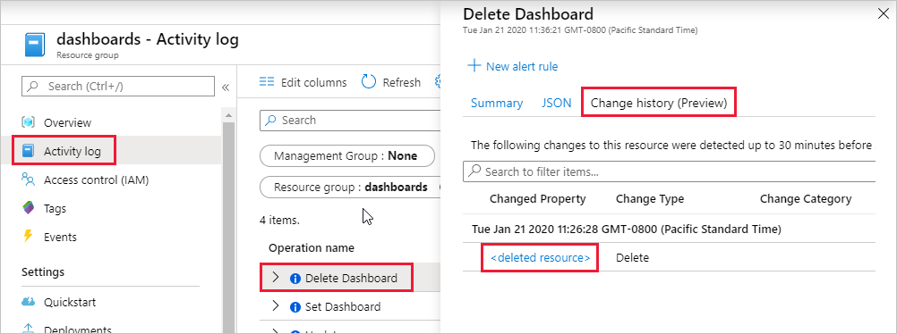
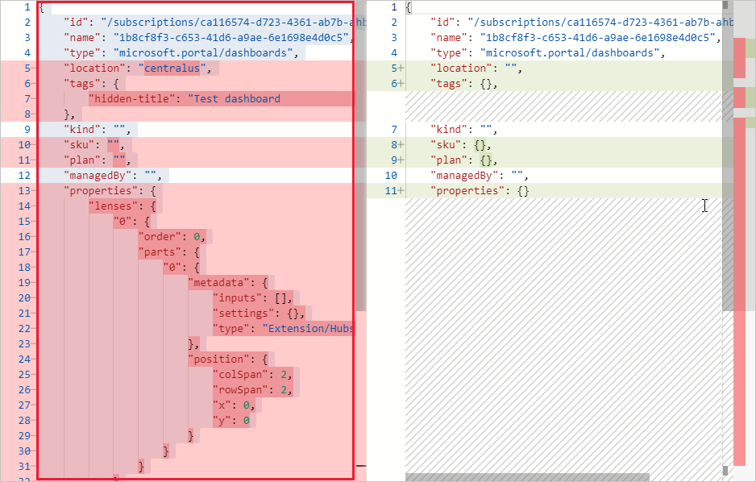

# Recover a deleted dashboard in the Azure portal

If you delete a _published_ dashboard in the Azure portal, you can recover that dashboard within 14 days of the delete. If the dashboard isn't published, you cannot recover it, and you must rebuild it. For more information about publishing a dashboard, see [Publish dashboard](azure-portal-dashboard-share-access.md#publish-dashboard). Follow these steps to recover a published dashboard:

1. From the Azure portal menu, select **Resource groups**, then select the resource group where you published the dashboard (by default, it's named **dashboards**).

1. Under **Activity log**, expand the **Delete Dashboard** operation. Select the **Change history** tab, then select **\<deleted resource\>**.

    

1. Select and copy the contents of the left pane, then save to a text file with a _.json_ file extension. The portal uses the JSON file to re-create the dashboard.

    

1. From the Azure portal menu, select **Dashboards**, then select **Upload**.

    

1. Select the JSON file you saved. The portal re-creates the dashboard with the same name and elements as the deleted dashboard.

1. Select **Share** to publish the dashboard and re-establish the appropriate access control.

    
