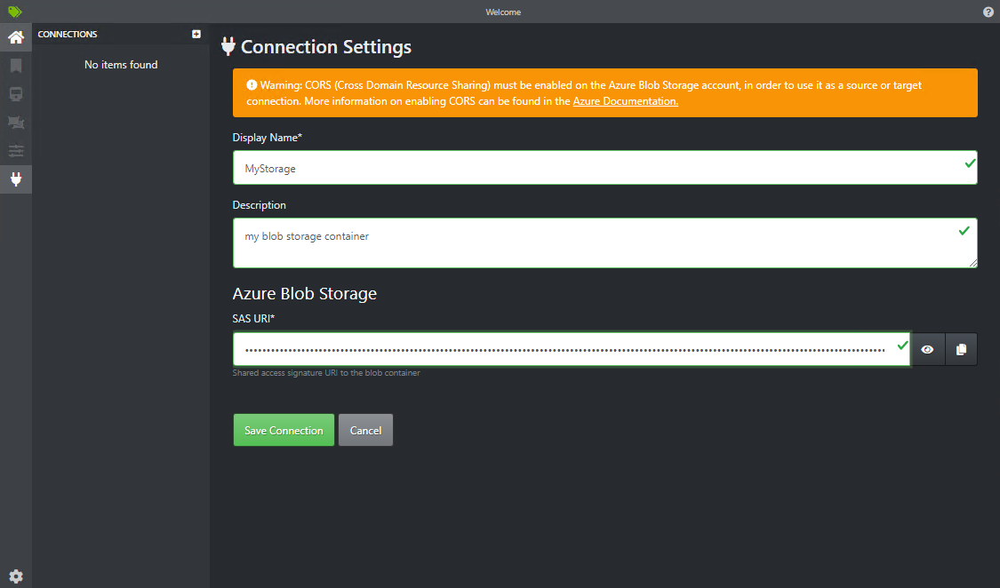
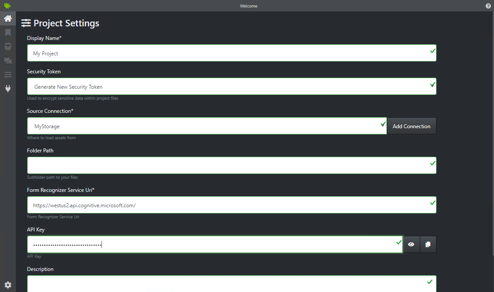
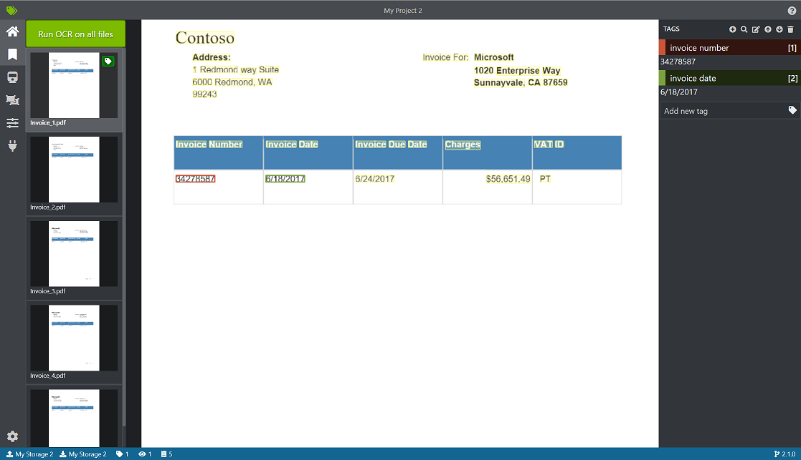
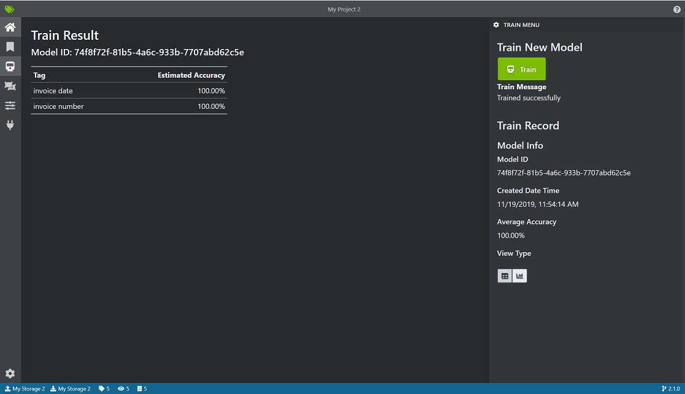

# Train a Form Recognizer model with labels using the sample labeling tool

In this quickstart, you'll use the Form Recognizer REST API with the sample labeling tool to train a custom model with manually labeled data. See the [Train with labels](../overview.md#train-with-labels) section of the overview to learn more about this feature.

If you don't have an Azure subscription, create a [free account](https://azure.microsoft.com/free/?WT.mc_id=A261C142F) before you begin.

## Prerequisites

To complete this quickstart, you must have:
- Access to the Form Recognizer limited-access preview. To get access to the preview, fill out and submit the [Form Recognizer access request form](https://aka.ms/FormRecognizerRequestAccess). You'll receive an email with a link to create a Form Recognizer resource.
- Access to the Form Recognizer sample labeling tool. To get access, fill out and submit the [Form Recognizer label tool request form](https://aka.ms/LabelToolRequestAccess). You'll receive an email with instructions on how to obtain your credentials and access the private container registry. 
- A set of at least six forms of the same type. You'll use this data to train the model and test a form. You can use a [sample data set](https://go.microsoft.com/fwlink/?linkid=2090451) for this quickstart. Upload the training files to the root of a blob storage container in an Azure Storage account.

## Set up the sample labeling tool

You'll use the Docker engine to run the sample labeling tool. Follow these steps to set up the Docker container. For a primer on Docker and container basics, see the [Docker overview](https://docs.docker.com/engine/docker-overview/).
1. First, install Docker on a host computer. The host computer can be your local computer ([Windows](https://docs.docker.com/docker-for-windows/), [MacOS](https://docs.docker.com/docker-for-mac/), or [Linux](https://docs.docker.com/install/)). Or, you can use a Docker hosting service in Azure, such as the [Azure Kubernetes Service](https://docs.microsoft.com/azure/aks/index), [Azure Container Instances](https://docs.microsoft.com/azure/container-instances/index), or a Kubernetes cluster [deployed to an Azure Stack](https://docs.microsoft.com/azure-stack/user/azure-stack-solution-template-kubernetes-deploy?view=azs-1910). The host computer must meet the following hardware requirements:

    | Container | Minimum | Recommended|
    |:--|:--|:--|
    |Sample labeling tool|2 core, 4-GB memory|4 core, 8-GB memory|
    
1. Next, you'll need the [Azure command-line interface (CLI)](https://docs.microsoft.com/cli/azure/install-azure-cli?view=azure-cli-latest). Install it on your machine if you haven't already.
1. Then enter the following command in a command prompt. The values for `<username>` and `<password>` are in your Welcome to Form Recognizer email.
    ```
    docker login containerpreview.azurecr.io -u <username> -p <password>
    ```
1. Get the sample labeling tool container with the `docker pull` command.
    ```
    docker pull containerpreview.azurecr.io/microsoft/cognitive-services-form-recognizer-custom-supervised-labeltool:latest
    ```
1. Now you're ready to run the container with `docker run`.
    ```
    docker run -it -p 3000:80 containerpreview.azurecr.io/microsoft/cognitive-services-form-recognizer-custom-supervised-labeltool eula=accept
    ```

   This command will make the sample labeling tool available through a web browser. Go to [http://localhost:3000](http://localhost:3000).

> [!NOTE]
> You can also label documents and train models using the Form Recognizer REST API. To train and Analyze with the REST API, see [Train with labels using the REST API and Python](./python-labeled-data.md).

## Set up input data

First, make sure all the training documents are of the same format. If you have forms in multiple formats, organize them into subfolders based on common format. When you train, you'll need to direct the API to a subfolder.

### Configure cross-domain resource sharing (CORS)

Enable CORS on your storage account. Select your storage account in the Azure portal and click the **CORS** tab on the left pane. On the bottom line, fill in the following values. Then click **Save** at the top.

* Allowed origins = * 
* Allowed methods = \[select all\]
* Allowed headers = *
* Exposed headers = * 
* Max age = 200

> [!div class="mx-imgBorder"]
> 

## Connect to the sample labeling tool

The sample labeling tool connects to a source (where your original forms are) and a target (the location where it exports the created labels and output data).

Connections can be set up and shared across projects. They use an extensible provider model, so you can easily add new source/target providers.

To create a new connection, click the **New Connections** (plug) icon, in the left navigation bar.

Fill in the fields with the following values:

* **Display Name** - The connection display name.
* **Description** - Your project description.
* **SAS URL** - The shared access signature (SAS) URL of your Azure Blob Storage container. To retrieve the SAS URL, open the Microsoft Azure Storage Explorer, right-click your container, and select **Get shared access signature**. Set the expiry time to some time after you'll have used the service. Make sure the **Read**, **Write**, **Delete**, and **List** permissions are checked, and click **Create**. Then copy the value in the **URL** section. It should have the form: `https://<storage account>.blob.core.windows.net/<container name>?<SAS value>`.



## Create a new project

In the sample labeling tool, projects store your configurations and settings. Create a new project and fill in the fields with the following values:

* **Display Name** - the project display name
* **Security Token** - Some project settings can include sensitive values, such as API keys or other shared secrets. Each project will generate a security token that can be used to encrypt/decrypt sensitive project settings. Security tokens can be found in Application Settings by clicking the gear icon in the lower corner of the left navigation bar.
* **Source Connection** - The Azure Blob Storage connection you created in the previous step that you would like to use for this project.
* **Folder Path** - Optional - If your source forms are located in a folder on the blob container, specify the folder name here
* **Form Recognizer Service Uri** - Your Form Recognizer endpoint URL.
* **API Key** - Your Form Recognizer subscription key.
* **Description** - Optional - Project description



## Label your forms

When you create or open a project, the main tag editor window opens. The tag editor consists of three parts:

* A resizable preview pane that contains a scrollable list of forms from the source connection.
* The main editor pane that allows you to apply tags.
* The tags editor pane that allows users to modify, lock, reorder, and delete tags. 

### Identify text elements

Click **Run OCR on all files** on the left pane to get the text layout information for each document. The labeling tool will draw bounding boxes around each text element.

### Apply labels to text

Next, you'll create labels and apply them to the text elements that you want the model to recognize.

1. First, use the tags editor pane to create the tags (labels) you'd like to identify.
1. In the main editor, click and drag to select one or multiple words from the highlighted text elements.

    > [!NOTE]
    > You cannot currently select text that spans across multiple pages.
1. Click on the tag you want to apply, or press corresponding keyboard key. You can only apply one tag to each selected text element, and each tag can only be applied once per page.

    > [!TIP]
    > The number keys are assigned as hotkeys for the first ten tags. You can reorder your tags using the up and down arrow icons in the tag editor pane.

Follow the above steps to label five of your forms, and then move on to the next step.




## Train a custom model

Click the Train icon (the train car) on the left pane to open the Training page. Then click the **Train** button to begin training the model. Once the training process completes, you'll see the following information:

* **Model ID** - The ID of the model that was created and trained. Each training call creates a new model with its own ID. Copy this string to a secure location; you'll need it if you want to do prediction calls through the REST API.
* **Average Accuracy** - The model's average accuracy. You can improve model accuracy by labeling additional forms and training again to create a new model. We recommend starting by labeling five forms and adding more forms as needed.
* The list of tags, and the estimated accuracy per tag.



After training finishes, examine the **Average Accuracy** value. If it's low, you should add more input documents and repeat the steps above. The documents you've already labeled will remain in the project index.

> [!TIP]
> You can also run the training process with a REST API call. To learn how to do this, see [Train with labels using Python](./python-labeled-data.md).

## Analyze a form

Click on the Predict (rectangles) icon on the left to test your model. Upload a form document that you didn't use in the training process. Then click the **Predict** button on the right to get key/value predictions for the form. The tool will apply tags in bounding boxes and will report the confidence of each tag.

> [!TIP]
> You can also run the Analyze API with a REST call. To learn how to do this, see [Train with labels using Python](./python-labeled-data.md).

## Improve results

Depending on the reported accuracy, you may want to do further training to improve the model. After you've done a prediction, examine the confidence values for each of the applied tags. If the average accuracy training value was high, but the confidence scores are low (or the results are inaccurate), you should add the file used for prediction into the training set, label it, and train again.

The reported average accuracy, confidence scores, and actual accuracy can be inconsistent when the documents being analyzed are different from those used in training. Keep in mind that some documents look similar when viewed by people but can look distinct to the AI model. For example, you might train with a form type that has two variations, where the training set consists of 20% variation A and 80% variation B. During prediction, the confidence scores for documents of variation A are likely to be lower.

## Save a project and resume later

To resume your project at another time or in another browser, you need to save your project's security token and reenter it later. 

### Get project credentials
Go to your project settings page (slider icon) and take note of the security token name. Then go to your application settings (gear icon), which shows all of the security tokens in your current browser instance. Find your project's security token and copy its name and key value to a secure location.

### Restore project credentials
When you want to resume your project, you first need to create a connection to the same blob storage container. Follow the steps above to do this. Then, go to the application settings page (gear icon) and see if your project's security token is there. If it isn't, add a new security token and copy over your token name and key from the previous step. Then click Save Settings. 

### Resume a project
Finally, go to the main page (house icon) and click Open Cloud Project. Then select the blob storage connection, and select your project's *.vott* file. The application will load all of the project's settings because it has the security token.

## Next steps

In this quickstart, you learned how to use the Form Recognizer sample labeling tool to train a model with manually labeled data. If you'd like to integrate the labeling tool into your own application, use the REST APIs that deal with labeled data training.

> [!div class="nextstepaction"]
> [Train with labels using Python](./python-labeled-data.md)
