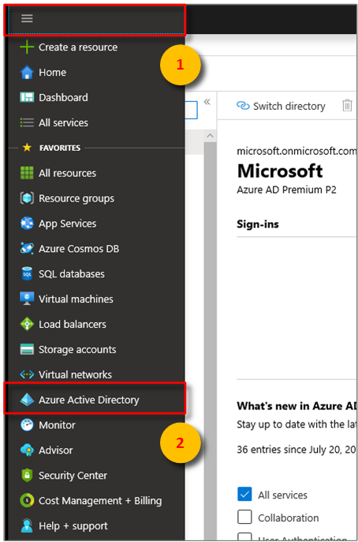
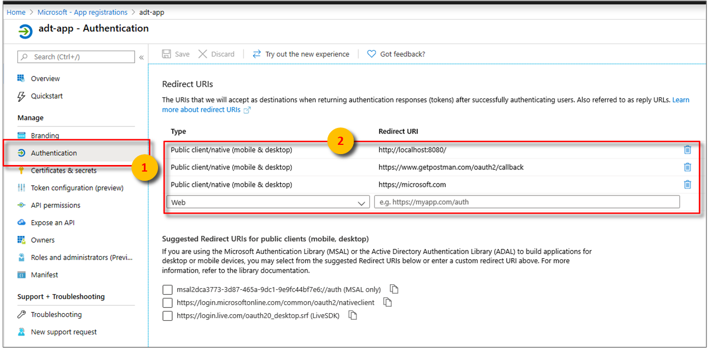
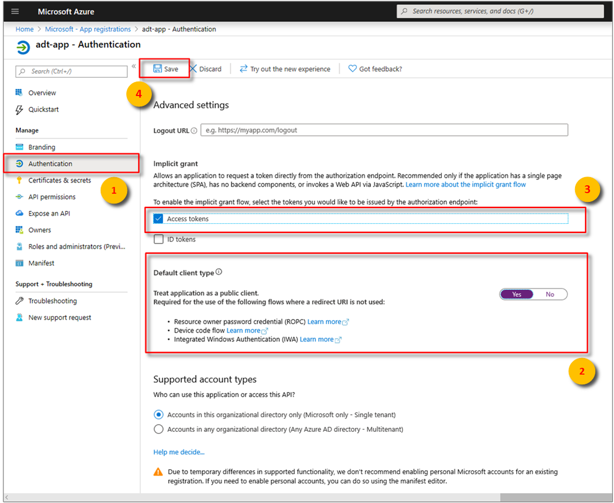

>[!NOTE]
>This section provides instructions for [Azure AD app registration](https://docs.microsoft.com/azure/active-directory/develop/quickstart-register-app).

1. In the [Azure portal](https://portal.azure.com), open **Azure Active Directory** from the expandable left menu, and then open the **App registrations** pane. 

    

1. Select the **+ New registration** button.

    

1. Give a friendly name for this app registration in the **Name** box. Under the **Redirect URI (optional)** section, choose **Public client/native (mobile & desktop)** in the drop-down menu on the left, and enter `https://microsoft.com` in the textbox on the right. Select **Register**.

    

1. To make sure that [the app is registered as a **public client**](https://docs.microsoft.com/azure/active-directory/develop/scenario-desktop-app-registration), open the **Authentication** pane for your app registration, and scroll down in that pane. In the **Default client type** section, choose **Yes** for **Treat application as a public client**, and hit **Save**.

    1. **Redirect URIs** must match the address supplied by the authentication request:

        * For apps hosted in a local development environment, select **Public client (mobile & desktop)**. Make sure to set the **Default client type** to yes.
        * For Single-Page apps hosted on Azure App Service, select **Web**.

        Select **Public client (mobile & desktop)** and enter `http://localhost:8080/`.

        

    1. Check **Access tokens** to configure the **oauth2AllowImplicitFlow** setting to `true` in your resource's **Manifest** JSON.

        

1.  Open the **Overview** pane of your registered app, and copy the values of the following entities to a temporary file. You'll use these values to configure your sample application in the following sections.

    - **Application (client) ID**
    - **Directory (tenant) ID**

    

1. Open the **API permissions** pane for your app registration. Select **+ Add a permission** button. In the **Request API permissions** pane, select the **APIs my organization uses** tab, and then search for one of the following:
    
    1. `Azure Digital Twins`. Select the **Azure Digital Twins** API.

        

    1. Alternatively, search for `Azure Smart Spaces Service`. Select the **Azure Smart Spaces Service** API.

        

    > [!IMPORTANT]
    > The Azure AD API name and ID that will appear depends on your tenant:
    > * Test tenant and customer accounts should search for `Azure Digital Twins`.
    > * Other Microsoft accounts should search for `Azure Smart Spaces Service`.

1. Either API will appear as **Azure Digital Twins** in the same **Request API permissions** pane once selected. Select the **Read** drop-down option, and then select the **Read.Write** checkbox. Select the **Add permissions** button.

    

1. Depending on your organization's settings, you might need to take additional steps to grant admin access to this API. Contact your administrator for more information. Once the admin access is approved, the **Admin Consent Required** column in the **API permissions** pane will display your permissions. 

    

    Verify that **Azure Digital Twins** appears.
